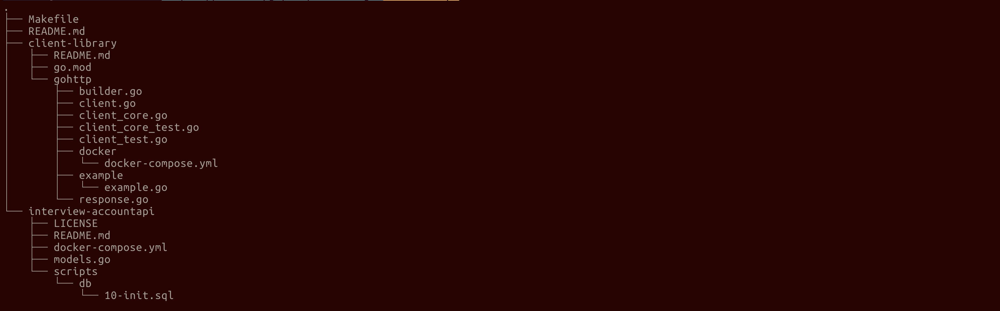
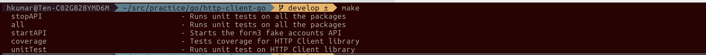
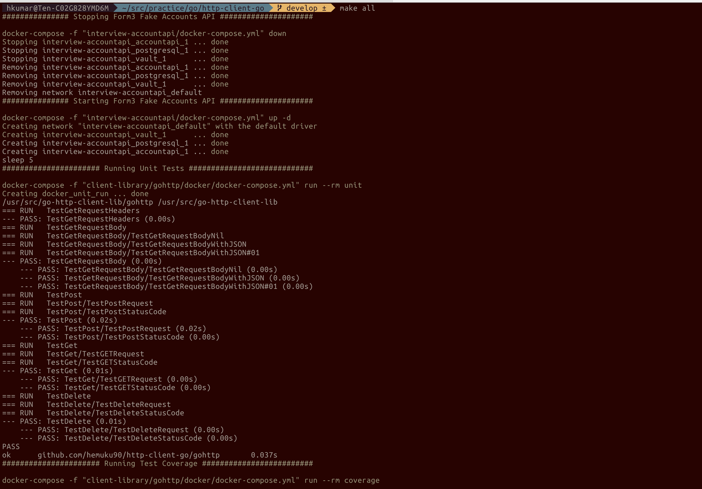

# Form3 Take Home Exercise's Solution

## Directory Structure
In the root directory, we have both the API and the Client library just for the purpose of the testing and easier to assess for the reviwer.
- interview-coount-api: This is the For3 Fake API against which testing was done.
- client-library: This is the actual custom HTTP client library against which we run our coverage and unit tests. 

There is a Makefile which is given as a utility for the reviwer to to interact with our API and the client library and should be asily be able to run unit tests, code coverage, start and stop the API.

In order to check all the Make targets, run make from the prject root directory.

In order to run the API and do unit tests, coverage on the client-library just run `make all`.

## Docs
[httpClient-Library](client-library/README.md)

[Form3-Fake-API](interview-accountapi/README.md)

### NOTE: I am not new to go but done only basic work in my previous organisation and most of things that I have learned in Go is by myself. It has been over one and half years since I have touched go.