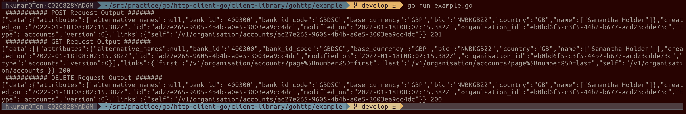

# http-client-go

A Go project demonstrating HTTP client library design and RESTful API integration, featuring a reusable HTTP client library and an Account API client built on top of it.

## Project Structure

```
.
├── client-library/       # Generic HTTP client library (gohttp)
└── interview-accountapi/ # Account API client using the gohttp library
```

## Client Library (`client-library/gohttp`)

A lightweight, configurable HTTP client library for Go with a clean builder pattern.

### Features

- Builder pattern for flexible client configuration
- Support for `GET`, `POST`, and `DELETE` operations
- Clean response handling

### Usage

```go
import "github.com/hemuku90/http-client-go/gohttp"

httpClient := gohttp.NewBuilder().
    Build()
```

The `httpClient` exposes `GET`, `POST`, and `DELETE` methods to make HTTP requests.

A sample program can be found in the `client-library/gohttp/example` directory.



## Account API Client (`interview-accountapi`)

A Go client library for interacting with a RESTful Account API. Demonstrates real-world usage of the HTTP client library against a dockerized microservices stack.

### Implemented Operations

- **Create** - Create a new account resource
- **Fetch** - Retrieve an account by ID
- **Delete** - Remove an account resource

### Account Data Model

The client works with structured account data including attributes such as:

- Account classification, number, and status
- Bank ID and BIC
- Currency and country
- IBAN and alternative names

### Running the API locally

The Account API runs as a Docker container with PostgreSQL and Vault:

```bash
cd interview-accountapi
docker-compose up
```

This starts the API on `http://localhost:8080`.

## Version

- v1.0.0

## License

Licensed under the Apache License, Version 2.0.
