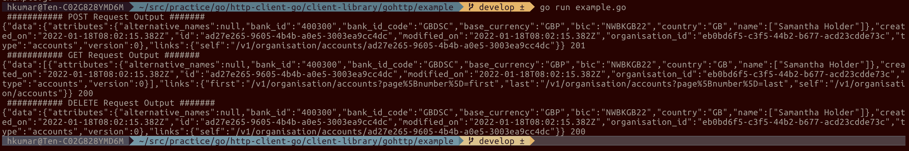

# http-client-go
Go HTTP Client Library
This clilent library currently has gohttp package to interact with http client library.
## Version
- v1.0.0
## Features
- POST,GET,DELETE
## Usage
In order to use this library. Please import the library:

```
import "github.com/hemuku90/http-client-go/gohttp"
httpClient = gohttp.NewBuilder().
		Build()
```
Using the `httpClient` which returns the `Client` exposes GET,POST,DELETE methods to make those requests. 

Sample program could be found in  `gohttp/example` directory. Sample screenshot for the execution is below:

